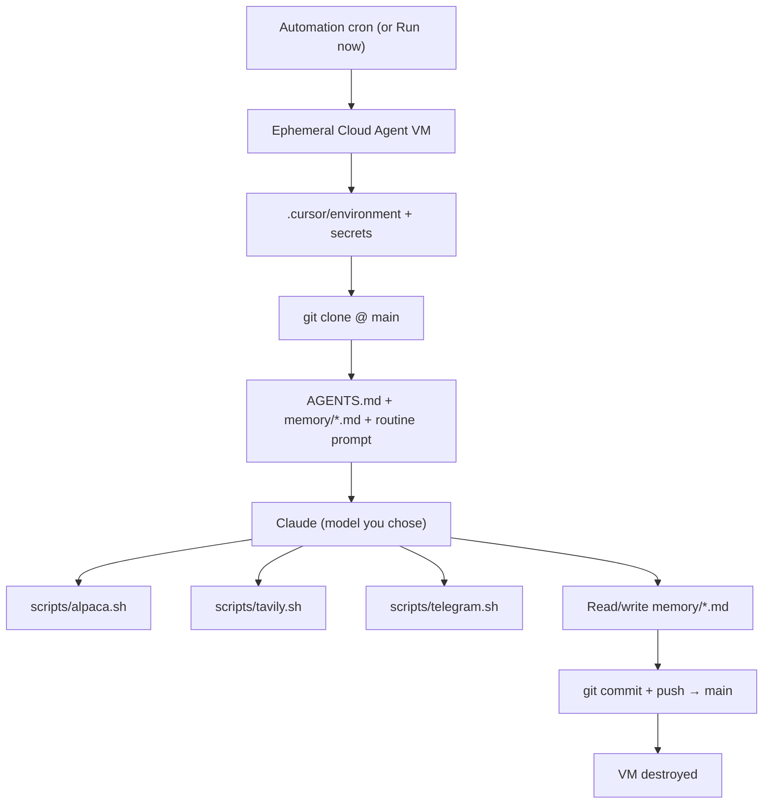

# Trading Bot — Cursor Automations Edition

Autonomous swing-trading bot that runs on **Cursor Automations** (Cloud Agents) with a frontier Claude model, **Alpaca** for execution, **Tavily** for web-backed research, and **Telegram** for alerts. Adapted from Nate Herk’s *Opus 4.7 Trading Bot — Setup Guide* (originally built on Claude Code cloud routines). The strategy rules, bash wrappers, git-backed memory, and routine prompts are the same idea; the **scheduler and hosting** are **Cursor** instead of Claude Code.

> Stocks only. No options, ever. The discipline is the strategy.

**First-time install** (GitHub app, secrets, crons, smoke test) lives in [`SETUP.md`](SETUP.md) — this README explains **behavior and architecture**, not step-by-step configuration.

---

## How this works

### The big picture

The bot is not a long-running server. It is **five scheduled jobs**: each one spins up a **fresh, disposable Linux VM**, runs a **language model** with your repo and secrets, and then **shuts down**. The only place anything survives between runs is **this Git repository on `main`**. That is intentional: the agent’s “memory” is whatever is committed in `memory/*.md` — you can read it, diff it, revert it, and audit it like any other code.

### One run, end to end

1. **Trigger** — A Cursor Automation fires on its cron (see table below) or you click **Run now** for a manual test.
2. **VM bootstrap** — [`.cursor/environment.json`](.cursor/environment.json) installs `jq` and `python3` and makes `scripts/*.sh` executable. [Cursor Cloud](https://cursor.com/docs/cloud-agent) injects your **secrets** as environment variables (not from a `.env` file in the repo).
3. **Clone** — The agent works from a **clean clone of `main`**. The previous run’s commits are the only “state” it sees, plus whatever it reads in this session.
4. **Context** — `AGENTS.md` is the agent rulebook. It also reads the relevant `memory/*.md` files and the **routine** it was given: one of the five playbooks in [`routines/`](routines/).
5. **Action** — It calls the **wrappers** only:
   - [`scripts/alpaca.sh`](scripts/alpaca.sh) — account, positions, orders, quotes, order placement
   - [`scripts/tavily.sh`](scripts/tavily.sh) — search/answer JSON for pre-market and research steps (optional fallback to the agent’s built-in web search if the key is missing)
   - [`scripts/telegram.sh`](scripts/telegram.sh) — one-shot messages to your chat  
   The prompts forbid raw `curl` to these APIs so keys and request shapes stay centralized and auditable.
6. **Persist** — It **appends or updates** files under `memory/`, then **`git add` + `git commit` + `git push` to `main`**. The next run must read new data from that push, so Automations are configured to **push directly to `main`**, not open a pull request.
7. **Teardown** — The VM is discarded. There is no database, no Redis, no “bot process” to restart.

This loop is the entire architecture: **schedule → model + tools → memory files in git → repeat.**

### Why git-as-memory

- **Durability** — If Cursor or Alpaca hiccups, you still have a structured log on GitHub.
- **Transparency** — Every decision that matters should leave a trail in `TRADE-LOG.md` / `RESEARCH-LOG.md` / `WEEKLY-REVIEW.md`.
- **Recovery** — Bad edit? `git revert`. Fork in time? Compare commits.
- **No secret leakage** — API keys never belong in the repo; they only exist in the Cloud Agent environment at runtime.

### A trading day in five beats

| Phase | What happens in plain terms |
|--------|----------------------------|
| **Pre-market** | Pull account snapshot, run Tavily queries on macro and catalysts, write a dated block to `RESEARCH-LOG.md` with ideas and a default **HOLD** unless there is a clear edge. Light Telegram. |
| **Market open** | Reconcile the plan with live quotes; place or adjust orders; **GTC 10% trailing stops**; update `TRADE-LOG.md`. This is the main “execution” beat. |
| **Midday** | Check positions against the -7% rule and trailing rules; trim or tighten; log changes. |
| **Daily summary** | End-of-day numbers and narrative into `TRADE-LOG.md` and a **Telegram** recap. |
| **Weekly review (Friday afternoon)** | Roll up the week, stats, and self-assessment in `WEEKLY-REVIEW.md`. |

Weekends are quiet: only crons you configure for `1–5` will fire on weekdays. **Weekly review** is typically one Automation on **Friday** only.

### The five automations and schedules

Cron strings below match **Pacific Time** if your Cursor UI does not offer a timezone (see [`SETUP.md`](SETUP.md)). They line up with **US market hours in ET** (roughly: pre-market ≈ 2.5h before the open, market-open at the open, midday ~1:00pm ET, daily summary ~4:00pm ET close, weekly review Friday after the close). Adjust hours in the Automation if you are not in PT.

| Routine file | Cron (PT) | Role |
|--------------|-----------|------|
| [`routines/pre-market.md`](routines/pre-market.md) | `0 4 * * 1-5` | Research + ideas; `RESEARCH-LOG.md` |
| [`routines/market-open.md`](routines/market-open.md) | `30 6 * * 1-5` | Trades + stops; `TRADE-LOG.md` |
| [`routines/midday.md`](routines/midday.md) | `0 10 * * 1-5` | Management + stops; log |
| [`routines/daily-summary.md`](routines/daily-summary.md) | `0 13 * * 1-5` | EOD snapshot; Telegram |
| [`routines/weekly-review.md`](routines/weekly-review.md) | `0 14 * * 5` | Friday: `WEEKLY-REVIEW.md` |

The **model** (e.g. Opus vs Sonnet) is chosen per Automation in the Cursor UI — not in the markdown files. Heavier judgment (opens, position management) may warrant a larger model; pure research or recap can use a smaller one. Cloud Agents use **Max Mode**-style full runs; **usage** draws from your plan’s **API credit pool** and can **overage** at published model rates. Set a **spend cap** in Cursor if you want a hard ceiling.



## Repository layout

```
claudebot/
├── AGENTS.md                 # Auto-loaded rules for every agent session
├── README.md                 # This file
├── SETUP.md                  # One-time dashboard setup (GitHub, secrets, crons, smoke test)
├── env.template              # Local var names only; real secrets in Cursor, not in git
├── .gitignore
├── .cursor/
│   └── environment.json      # Cloud VM: jq, python3, executable scripts
├── routines/                 # Full text pasted into each Automation as the prompt
│   ├── pre-market.md
│   ├── market-open.md
│   ├── midday.md
│   ├── daily-summary.md
│   └── weekly-review.md
├── scripts/                  # Only supported path to external APIs
│   ├── alpaca.sh
│   ├── tavily.sh
│   └── telegram.sh
└── memory/                   # Durable state (must be committed to main)
    ├── TRADING-STRATEGY.md
    ├── TRADE-LOG.md
    ├── RESEARCH-LOG.md
    ├── WEEKLY-REVIEW.md
    └── PROJECT-CONTEXT.md
```

## The trading strategy at a glance

- **Stocks only**, never options.
- Max 5–6 open positions, max 20% per position, target 75–85% deployed.
- Max 3 new trades per week.
- Every position gets a **10% trailing stop** as a real GTC order.
- Cut any losing position at **-7%** from entry, manually.
- Tighten trail to **7%** at +15% gain, to **5%** at +20%.
- Never tighten within **3%** of the current price. **Never** move a stop down.
- Exit a sector after two consecutive failed trades.
- **Patience > activity.**

Full rulebook: [`memory/TRADING-STRATEGY.md`](memory/TRADING-STRATEGY.md).

## Safety and operations

- The agent can place real orders through Alpaca. **Run on paper** until you are confident, then point **Alpaca** secrets at live keys and the live **endpoint** (see `SETUP.md` — no code change required for the switch).
- Treat **main** as the live tape: if branch protection or PRs block pushes, the next run will not see the last run’s memory.
- If something looks wrong, **stop the Automations**, inspect the last commits on `main`, and use `git revert` if you need to undo a bad memory write.

---

*Operational setup: [`SETUP.md`](SETUP.md) · Models and billing: [cursor.com/docs/models-and-pricing](https://cursor.com/docs/models-and-pricing)*
